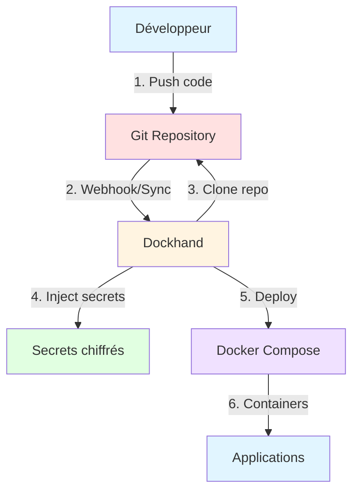
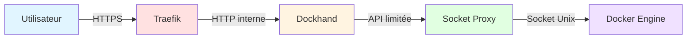

Comment j'ai centralisé la gestion de toutes mes stacks Docker avec Dockhand, un outil moderne qui combine l'interface web intuitive, le versioning Git et la gestion sécurisée des secrets.

<p align="center">
  
</p>

<!--truncate-->

## Le problème : mes stacks sans historique ni centralisation

Quand on gère plusieurs dizaines de services Docker sur plusieurs machines, on se retrouve vite avec un problème : **comment garder une trace de tout ?**

Avant Dockhand, ma situation ressemblait à ça :

- Des fichiers `compose.yaml` éparpillés dans `/opt/stacks/` sur différentes VMs
- Aucun historique des modifications (qui a changé quoi ? quand ? pourquoi ?)
- Des secrets en clair dans les fichiers `.env`
- Impossible de déployer rapidement la même stack sur une autre machine
- Pas de centralisation : je devais SSH sur chaque machine pour modifier une config

Bref, c'était le chaos. Et si je perdais une VM, je perdais aussi tout l'historique de configuration.

## La solution : Git comme source of truth + Dockhand pour déployer

La solution est simple et élégante :

1. **Git devient la source de vérité** : tous mes `compose.yaml` sont versionnés dans un dépôt Git privé (Forgejo dans mon cas)
2. **Dockhand gère les déploiements** : une interface web moderne qui déploie depuis Git et gère les secrets de manière sécurisée
3. **Fini les secrets en clair** : Dockhand chiffre les secrets et les injecte au déploiement

Cette approche me donne :

- **Historique complet** : chaque modification est tracée dans Git
- **Centralisation** : un seul endroit pour gérer toutes mes stacks
- **Sécurité** : les secrets ne sont jamais committés en clair
- **Multi-environnements** : je peux gérer plusieurs VMs depuis une seule interface
- **Reproductibilité** : je peux redéployer n'importe quelle stack en quelques clics

**Flux GitOps** :



## Qu'est-ce que Dockhand ?

[Dockhand](https://github.com/Finsys/dockhand) est une interface de gestion Docker moderne développée par Finsys. C'est une alternative légère et élégante à Portainer.

### Fonctionnalités principales

- **Gestion des conteneurs** : démarrer, arrêter, redémarrer, surveiller en temps réel
- **Orchestration Compose** : éditeur visuel pour les déploiements Docker Compose
- **Intégration Git** : déploiement depuis des dépôts avec webhooks et synchronisation automatique
- **Support multi-environnements** : gestion des hôtes Docker locaux et distants
- **Terminal et logs** : accès shell interactif et streaming de logs en temps réel
- **Explorateur de fichiers** : navigation, upload et téléchargement depuis les conteneurs
- **Gestion des secrets** : chiffrement et injection sécurisée des variables sensibles

### Stack technologique

- **Frontend** : SvelteKit 2, Svelte 5, shadcn-svelte, TailwindCSS
- **Backend** : Runtime Bun avec routes API SvelteKit
- **Base** : SQLite ou PostgreSQL via Drizzle ORM
- **Infrastructure** : Communication directe avec l'API Docker

### Licence

Dockhand utilise la Business Source License 1.1 (BSL) :
- Gratuit pour : usage personnel, usage interne en entreprise, organisations à but non lucratif, éducation, évaluation
- La licence sera convertie en Apache 2.0 le 1er janvier 2029

## Mise en place de Dockhand

### Étape 1 : Socket Proxy (sécurité)

Avant de déployer Dockhand, j'utilise un **socket proxy** pour éviter d'exposer directement le socket Docker aux applications. C'est un principe de moindre privilège : chaque service ne peut accéder qu'aux endpoints Docker dont il a besoin.

<details>
<summary>Configuration du Socket Proxy (cliquez pour déplier)</summary>

```yaml
services:
  socket-proxy:
    image: wollomatic/socket-proxy:1.11.0
    container_name: socket-proxy
    restart: unless-stopped
    user: "65534:988"  # nobody:docker
    mem_limit: 64M
    read_only: true
    cap_drop:
      - ALL
    security_opt:
      - no-new-privileges
    command:
      - '-loglevel=info'
      - '-listenip=0.0.0.0'
      - '-proxycontainername=socket-proxy'  # Active les allowlists per-container
      - '-watchdoginterval=3600'
      - '-stoponwatchdog'
      - '-shutdowngracetime=5'
    environment:
      - SP_ALLOWHEALTHCHECK=true
    volumes:
      - /var/run/docker.sock:/var/run/docker.sock:ro
    networks:
      - socket-proxy
    healthcheck:
      test: ["CMD", "./healthcheck"]
      interval: 10s
      timeout: 5s
      retries: 2

networks:
  socket-proxy:
    name: socket-proxy
    driver: bridge
    internal: true
```

Je détaillerai le socket proxy dans un article dédié. Pour l'instant, retenez que c'est une couche de sécurité entre Docker et vos applications.

</details>

**Architecture de sécurité** :



Ce schéma montre comment chaque couche ajoute une protection supplémentaire entre l'utilisateur et le Docker Engine.

### Étape 2 : Déploiement de Dockhand

Voici mon fichier `compose.yaml` pour Dockhand :

```yaml
services:
  dockhand:
    image: fnsys/dockhand:v1.0.14
    container_name: dockhand
    restart: unless-stopped
    ports:
      - "192.168.100.160:3001:3000"
    networks:
      - traefik_private
      - socket-proxy
    volumes:
      - /opt/stacks/dockhand:/opt/stacks/dockhand
    environment:
      - DATA_DIR=/opt/stacks/dockhand
      - TZ=Europe/Paris
    labels:
      - "traefik.enable=true"
      - "traefik.docker.network=traefik_private"
      - "traefik.http.routers.dockhand-local.rule=Host(`dockhand.local.tellserv.fr`)"
      - "traefik.http.routers.dockhand-local.entrypoints=local"
      - "traefik.http.routers.dockhand-local.tls=true"
      - "traefik.http.routers.dockhand-local.tls.certresolver=cloudflare-local"
      - "traefik.http.services.dockhand.loadbalancer.server.port=3000"
      - "socket-proxy.allow.get=.*"
      - "socket-proxy.allow.post=.*"
      - "socket-proxy.allow.delete=.*"
      - "socket-proxy.allow.head=.*"

networks:
  socket-proxy:
    external: true
  traefik_private:
    external: true
```

**Points importants** :

- **Version de l'image** : `v1.0.14` - Vérifiez la dernière version stable sur [Docker Hub](https://hub.docker.com/r/fnsys/dockhand/tags) avant de déployer
- **Port bindé sur IP locale** : `192.168.100.160:3001` - Adaptez à votre configuration :
  - Remplacez par votre IP statique locale si vous utilisez Traefik sur la même machine
  - Utilisez `127.0.0.1:3001:3000` si vous n'utilisez qu'en local sans reverse proxy distant
  - **Évitez** `0.0.0.0` qui expose le service sur toutes les interfaces (risque de sécurité)
  - Note : Le port `3001` est exposé sur l'hôte, mais Traefik communique en interne sur le port `3000` du conteneur
- **Socket proxy** : connexion via le réseau `socket-proxy` au lieu d'exposer directement `/var/run/docker.sock`
- **Traefik** : reverse proxy pour l'accès HTTPS avec certificat automatique
- **Permissions socket-proxy** : les labels `socket-proxy.allow.*` définissent les points de terminaison (endpoints) autorisés de l'API Docker

:::warning[Sécurité]
Dockhand donne un accès complet à votre infrastructure Docker. **Ne l'exposez jamais publiquement** et utilisez toujours une authentification forte. Gardez ce service en interne uniquement.
:::

:::tip[Ordre de démarrage]
Le réseau `socket-proxy` est déclaré comme `external: true`, ce qui signifie qu'il doit déjà exister. Assurez-vous de **démarrer la stack Socket Proxy AVANT** celle de Dockhand, sinon vous obtiendrez une erreur indiquant que le réseau externe est introuvable.
:::

**Déploiement** :

```bash
docker compose up -d
```

L'interface est maintenant accessible sur `https://dockhand.local.tellserv.fr` (dans mon cas).

### Étape 3 : Ajout des environnements Docker

Une fois Dockhand déployé, je configure les **environnements** (mes différentes VMs Docker).

**Settings → Environments → Add environment**


Trois types de connexion sont possibles :

1. **Unix socket** : si vous avez passé directement le socket Docker au conteneur Dockhand (déconseillé)
2. **Direct connection** : connexion HTTP/HTTPS à l'API Docker (via socket proxy dans mon cas)
3. **Hawser agent (edge)** : connexion passive où c'est l'environnement distant qui initie la connexion (parfait pour les machines derrière NAT)

Dans mon cas, j'utilise **Direct connection** avec mon socket proxy :


- **Name** : `Tellprod`
- **Connection type** : `Direct connection`
- **Host** : `socket-proxy` (le nom du conteneur)
- **Port** : `2375`
- **Protocol** : `HTTP` (le socket proxy n'utilise pas TLS en interne)

## Préparation du dépôt Git

Maintenant que Dockhand est opérationnel, je vais migrer toutes mes stacks Docker vers Git.

### Étape 1 : Créer le dépôt Git

J'ai créé un dépôt privé sur mon instance Forgejo : `tellprod_compose.git`

### Étape 2 : Organiser les stacks

Structure de mon dépôt :

```
tellprod_compose/
├── mobilizon/
│   └── compose.yml
├── audiobookshelf/
│   └── compose.yml
├── freshrss/
│   └── compose.yml
├── zabbix/
│   └── compose.yml
└── ...
```

Chaque service a son propre dossier avec un fichier `compose.yml`.

### Étape 3 : Supprimer les secrets

**CRITIQUE** : avant de commit, je dois supprimer **tous les secrets** de mes fichiers `compose.yml` et `.env`.

Les secrets seront gérés par Dockhand et injectés au moment du déploiement.

Par exemple, au lieu de :

```yaml
environment:
  - POSTGRES_PASSWORD=SuperSecretPassword123
  - MOBILIZON_INSTANCE_EMAIL=contact@tellserv.fr
```

Je mets des variables :

```yaml
environment:
  - POSTGRES_PASSWORD=${POSTGRES_PASSWORD}
  - MOBILIZON_INSTANCE_EMAIL=${MOBILIZON_INSTANCE_EMAIL}
```

### Étape 4 : Commit et push

```bash
git add .
git commit -m "Initial commit: All Compose stacks, with secrets placeholders"
git push origin main
```


Toutes mes stacks sont maintenant versionnées et centralisées.

:::tip[Protection supplémentaire avec .gitignore]
Pour éviter tout risque de commit accidentel de secrets, ajoutez un fichier `.gitignore` à la racine de votre dépôt :

```gitignore
# Fichiers de secrets locaux
.env
*.env
**/.env
**/*.env

# Fichiers temporaires
*.tmp
*.swp
*~
```

Ainsi, même si vous oubliez de remplacer un secret par une variable, Git refusera de le committer.
:::

## Configuration du dépôt Git dans Dockhand

### Étape 1 : Ajouter les credentials (si dépôt privé)

**Settings → Git → Credentials → Add credential**

- **Type** : `Password` (pour Forgejo)
- **Name** : `Forgejo (Password)`
- **Username** : mon nom d'utilisateur Forgejo
- **Password** : mot de passe ou token API

### Étape 2 : Ajouter le dépôt

**Settings → Git → Repositories → Add repository**


- **Name** : `tellprod_compose`
- **Repository URL** : `https://forgejo.tellserv.fr/Tellsanguis/tellprod_compose.git`
- **Branch** : `main`
- **Credential** : sélectionner `Forgejo (Password)`

Cliquer sur **Test** pour vérifier la connexion, puis **Save changes**.

## Déploiement depuis Git

Maintenant vient la partie magique : déployer mes stacks directement depuis Git.

### Étape 1 : Arrêter l'ancienne stack

Avant de migrer vers Dockhand, je dois arrêter mes anciennes stacks déployées manuellement :

```bash
cd /opt/stacks/mobilizon
docker compose down
```


### Étape 2 : Déployer depuis Git

**Stacks → From Git** (bouton en haut à droite)


**Configuration du déploiement** :


1. **Repository** : sélectionner `tellprod_compose`
2. **Stack name** : `mobilizon`
3. **Compose file path** : `mobilizon/compose.yml` (chemin relatif dans le repo)
4. **Environment variables** :
   - Cliquer sur **Populate** en haut à droite
   - Dockhand remplit automatiquement les variables avec les valeurs du `.env` du dépôt (si présent)
   - Modifier les valeurs avec les vraies valeurs
   - **Cliquer sur l'icône de clé** à droite des variables sensibles pour les marquer comme secrets chiffrés

5. **Enable scheduled sync** : activer pour synchroniser automatiquement avec Git
   - **Daily** à **03:00** (par exemple)
   - Dockhand vérifiera quotidiennement s'il y a des changements dans le repo et redéploiera si nécessaire

6. **Enable webhook** : OFF pour l'instant (on peut le configurer plus tard pour un déploiement immédiat à chaque push Git)

7. **Deploy now** : ON

Cliquer sur **Deploy** et c'est parti.

Dockhand va :
1. Cloner le dépôt Git
2. Lire le fichier `compose.yml` dans `mobilizon/`
3. Injecter les secrets chiffrés
4. Déployer la stack via `docker compose up -d`

En quelques secondes, la stack est déployée. Et toutes les variables sensibles sont stockées chiffrées dans la base de données de Dockhand.

## Résultat : gestion centralisée et sécurisée

Après quelques heures de migration, toutes mes stacks sont maintenant gérées par Dockhand :

- **Historique complet** : chaque modification est versionnée dans Git
- **Centralisation** : une seule interface pour gérer toutes mes VMs
- **Sécurité** : les secrets sont chiffrés dans Dockhand, jamais en clair dans Git
- **Synchronisation automatique** : Dockhand redéploie automatiquement si le repo Git change
- **Reproductibilité** : je peux redéployer n'importe quelle stack en quelques clics
- **Multi-environnements** : je peux gérer plusieurs VMs depuis la même interface

### Avantages concrets

**Git comme source of truth** :
- Je peux revenir en arrière si une modification casse quelque chose
- Je peux voir qui a modifié quoi et quand
- Je peux collaborer avec d'autres (pull requests, code review)

**Dockhand comme orchestrateur** :
- Interface moderne et intuitive (bien mieux que l'ancienne Portainer)
- Gestion native des secrets chiffrés
- Support multi-environnements (je peux gérer plusieurs VMs)
- Synchronisation automatique avec Git
- Logs en temps réel, accès shell, explorateur de fichiers

**Sécurité** :
- Plus de secrets en clair dans les fichiers
- Socket proxy pour limiter l'accès à l'API Docker
- Service non exposé publiquement

## Prochaines étapes : automatisation avec Renovate Bot

Pour aller encore plus loin, je vais configurer **Renovate Bot** pour automatiser les mises à jour de mes images Docker.

### Pourquoi Renovate plutôt que Watchtower ?

Beaucoup utilisent **Watchtower** pour mettre à jour automatiquement leurs conteneurs. Mais Watchtower a un défaut majeur : il met à jour directement les conteneurs en production, sans validation.

Avec l'approche **GitOps + Renovate** :
- Renovate crée des **Pull Requests** dans Git avec les nouvelles versions
- Je peux **tester et valider** avant de merger
- Git garde l'**historique** de toutes les mises à jour
- Si une mise à jour casse quelque chose, je peux facilement **revenir en arrière**
- Dockhand redéploie automatiquement après chaque merge

C'est beaucoup plus sûr et professionnel que les mises à jour "magiques" de Watchtower.

### Configuration de Renovate

Renovate va :
1. Analyser tous mes `compose.yml`
2. Détecter les nouvelles versions d'images disponibles
3. Créer automatiquement des Pull Requests dans Forgejo
4. Me permettre de valider et merger les mises à jour en un clic

Avec Dockhand qui synchronise automatiquement depuis Git, mes stacks seront mises à jour automatiquement après chaque merge.

Je détaillerai cette configuration dans un prochain article. En attendant, vous pouvez consulter [la documentation officielle de Renovate](https://docs.renovatebot.com/).

## Conclusion

Dockhand est un outil formidable pour centraliser et moderniser la gestion de ses stacks Docker.

L'approche **Git + Dockhand** combine le meilleur des deux mondes :
- Git pour l'historique et la collaboration
- Dockhand pour la gestion des secrets et le déploiement

Si vous gérez plusieurs services Docker, je vous recommande vivement de tester Dockhand. C'est simple, élégant, et ça change vraiment la façon de travailler.
