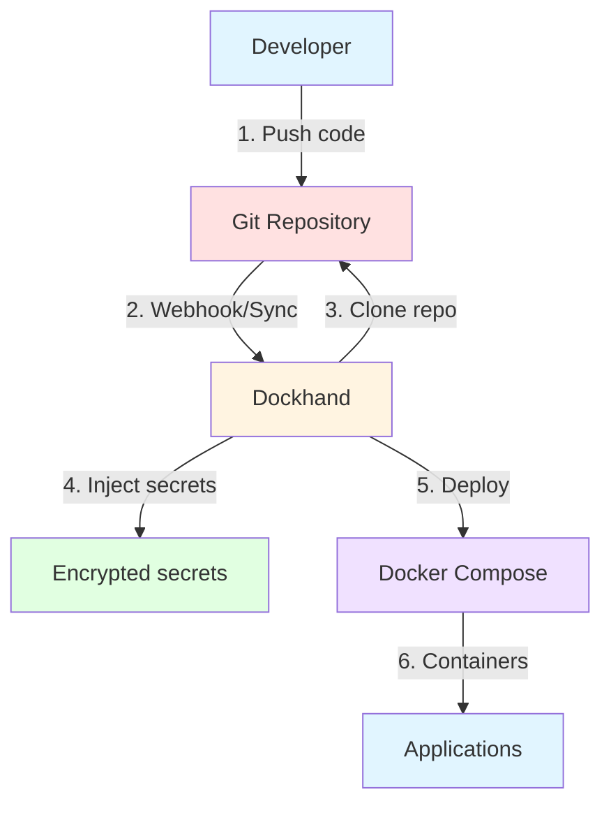
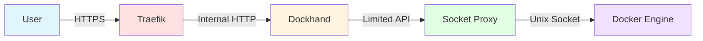

How I centralized the management of all my Docker stacks with Dockhand, a modern tool that combines an intuitive web interface, Git versioning, and secure secrets management.

<p align="center">
  
</p>

<!--truncate-->

## The problem: stacks without history or centralization

When managing dozens of Docker services across multiple machines, you quickly face a problem: **how do you keep track of everything?**

Before Dockhand, my situation looked like this:

- `compose.yaml` files scattered across `/opt/stacks/` on different VMs
- No modification history (who changed what? when? why?)
- Secrets in clear text in `.env` files
- Impossible to quickly deploy the same stack on another machine
- No centralization: I had to SSH into each machine to modify a config

In short, it was chaos. And if I lost a VM, I also lost the entire configuration history.

## The solution: Git as source of truth + Dockhand for deployment

The solution is simple and elegant:

1. **Git becomes the source of truth**: all my `compose.yaml` files are versioned in a private Git repository (Forgejo in my case)
2. **Dockhand manages deployments**: a modern web interface that deploys from Git and manages secrets securely
3. **No more clear text secrets**: Dockhand encrypts secrets and injects them at deployment time

This approach gives me:

- **Complete history**: every modification is tracked in Git
- **Centralization**: a single place to manage all my stacks
- **Security**: secrets are never committed in clear text
- **Multi-environment**: I can manage multiple VMs from a single interface
- **Reproducibility**: I can redeploy any stack with a few clicks

**GitOps workflow**:



## What is Dockhand?

[Dockhand](https://github.com/Finsys/dockhand) is a modern Docker management interface developed by Finsys. It's a lightweight and elegant alternative to Portainer.

### Main features

- **Container management**: start, stop, restart, monitor in real-time
- **Compose orchestration**: visual editor for Docker Compose deployments
- **Git integration**: deployment from repositories with webhooks and automatic synchronization
- **Multi-environment support**: management of local and remote Docker hosts
- **Terminal and logs**: interactive shell access and real-time log streaming
- **File explorer**: navigation, upload and download from containers
- **Secrets management**: encryption and secure injection of sensitive variables

### Technology stack

- **Frontend**: SvelteKit 2, Svelte 5, shadcn-svelte, TailwindCSS
- **Backend**: Bun runtime with SvelteKit API routes
- **Database**: SQLite or PostgreSQL via Drizzle ORM
- **Infrastructure**: Direct communication with Docker API

### License

Dockhand uses the Business Source License 1.1 (BSL):
- Free for: personal use, internal business use, non-profits, education, evaluation
- The license will be converted to Apache 2.0 on January 1st, 2029

## Setting up Dockhand

### Step 1: Socket Proxy (security)

Before deploying Dockhand, I use a **socket proxy** to avoid directly exposing the Docker socket to applications. It's a least privilege principle: each service can only access the Docker endpoints it needs.

<details>
<summary>Socket Proxy configuration (click to expand)</summary>

```yaml
services:
  socket-proxy:
    image: wollomatic/socket-proxy:1.11.0
    container_name: socket-proxy
    restart: unless-stopped
    user: "65534:988"  # nobody:docker
    mem_limit: 64M
    read_only: true
    cap_drop:
      - ALL
    security_opt:
      - no-new-privileges
    command:
      - '-loglevel=info'
      - '-listenip=0.0.0.0'
      - '-proxycontainername=socket-proxy'  # Enables per-container allowlists
      - '-watchdoginterval=3600'
      - '-stoponwatchdog'
      - '-shutdowngracetime=5'
    environment:
      - SP_ALLOWHEALTHCHECK=true
    volumes:
      - /var/run/docker.sock:/var/run/docker.sock:ro
    networks:
      - socket-proxy
    healthcheck:
      test: ["CMD", "./healthcheck"]
      interval: 10s
      timeout: 5s
      retries: 2

networks:
  socket-proxy:
    name: socket-proxy
    driver: bridge
    internal: true
```

I'll detail the socket proxy in a dedicated article. For now, remember that it's a security layer between Docker and your applications.

</details>

**Security architecture**:



This diagram shows how each layer adds additional protection between the user and the Docker Engine.

### Step 2: Dockhand deployment

Here's my `compose.yaml` file for Dockhand:

```yaml
services:
  dockhand:
    image: fnsys/dockhand:v1.0.14
    container_name: dockhand
    restart: unless-stopped
    ports:
      - "192.168.100.160:3001:3000"
    networks:
      - traefik_private
      - socket-proxy
    volumes:
      - /opt/stacks/dockhand:/opt/stacks/dockhand
    environment:
      - DATA_DIR=/opt/stacks/dockhand
      - TZ=Europe/Paris
    labels:
      - "traefik.enable=true"
      - "traefik.docker.network=traefik_private"
      - "traefik.http.routers.dockhand-local.rule=Host(`dockhand.local.tellserv.fr`)"
      - "traefik.http.routers.dockhand-local.entrypoints=local"
      - "traefik.http.routers.dockhand-local.tls=true"
      - "traefik.http.routers.dockhand-local.tls.certresolver=cloudflare-local"
      - "traefik.http.services.dockhand.loadbalancer.server.port=3000"
      - "socket-proxy.allow.get=.*"
      - "socket-proxy.allow.post=.*"
      - "socket-proxy.allow.delete=.*"
      - "socket-proxy.allow.head=.*"

networks:
  socket-proxy:
    external: true
  traefik_private:
    external: true
```

**Important points**:

- **Image version**: `v1.0.14` - Check the latest stable version on [Docker Hub](https://hub.docker.com/r/fnsys/dockhand/tags) before deploying
- **Port bound to local IP**: `192.168.100.160:3001` - Adapt to your configuration:
  - Replace with your local static IP if using Traefik on the same machine
  - Use `127.0.0.1:3001:3000` if only accessing locally without a remote reverse proxy
  - **Avoid** `0.0.0.0` which exposes the service on all interfaces (security risk)
  - Note: Port `3001` is exposed on the host, but Traefik communicates internally on the container's port `3000`
- **Socket proxy**: connection via the `socket-proxy` network instead of directly exposing `/var/run/docker.sock`
- **Traefik**: reverse proxy for HTTPS access with automatic certificate
- **Socket-proxy permissions**: the `socket-proxy.allow.*` labels define the allowed Docker API endpoints

:::warning[Security]
Dockhand provides full access to your Docker infrastructure. **Never expose it publicly** and always use strong authentication. Keep this service internal only.
:::

:::tip[Startup order]
The `socket-proxy` network is declared as `external: true`, meaning it must already exist. Make sure to **start the Socket Proxy stack BEFORE** the Dockhand one, otherwise you'll get an error indicating that the external network cannot be found.
:::

**Deployment**:

```bash
docker compose up -d
```

The interface is now accessible at `https://dockhand.local.tellserv.fr` (in my case).

### Step 3: Adding Docker environments

Once Dockhand is deployed, I configure the **environments** (my different Docker VMs).

**Settings → Environments → Add environment**


Three connection types are possible:

1. **Unix socket**: if you passed the Docker socket directly to the Dockhand container (discouraged)
2. **Direct connection**: HTTP/HTTPS connection to the Docker API (via socket proxy in my case)
3. **Hawser agent (edge)**: passive connection where the remote environment initiates the connection (perfect for machines behind NAT)

In my case, I use **Direct connection** with my socket proxy:


- **Name**: `Tellprod`
- **Connection type**: `Direct connection`
- **Host**: `socket-proxy` (the container name)
- **Port**: `2375`
- **Protocol**: `HTTP` (the socket proxy doesn't use TLS internally)

## Preparing the Git repository

Now that Dockhand is operational, I'm going to migrate all my Docker stacks to Git.

### Step 1: Create the Git repository

I created a private repository on my Forgejo instance: `tellprod_compose.git`

### Step 2: Organize the stacks

Structure of my repository:

```
tellprod_compose/
├── mobilizon/
│   └── compose.yml
├── audiobookshelf/
│   └── compose.yml
├── freshrss/
│   └── compose.yml
├── zabbix/
│   └── compose.yml
└── ...
```

Each service has its own folder with a `compose.yml` file.

### Step 3: Remove secrets

**CRITICAL**: before committing, I must remove **all secrets** from my `compose.yml` and `.env` files.

Secrets will be managed by Dockhand and injected at deployment time.

For example, instead of:

```yaml
environment:
  - POSTGRES_PASSWORD=SuperSecretPassword123
  - MOBILIZON_INSTANCE_EMAIL=contact@tellserv.fr
```

I put variables:

```yaml
environment:
  - POSTGRES_PASSWORD=${POSTGRES_PASSWORD}
  - MOBILIZON_INSTANCE_EMAIL=${MOBILIZON_INSTANCE_EMAIL}
```

### Step 4: Commit and push

```bash
git add .
git commit -m "Initial commit: All Compose stacks, with secrets placeholders"
git push origin main
```


All my stacks are now versioned and centralized.

:::tip[Additional protection with .gitignore]
To prevent any risk of accidentally committing secrets, add a `.gitignore` file at the root of your repository:

```gitignore
# Local secret files
.env
*.env
**/.env
**/*.env

# Temporary files
*.tmp
*.swp
*~
```

This way, even if you forget to replace a secret with a variable, Git will refuse to commit it.
:::

## Configuring the Git repository in Dockhand

### Step 1: Add credentials (if private repository)

**Settings → Git → Credentials → Add credential**

- **Type**: `Password` (for Forgejo)
- **Name**: `Forgejo (Password)`
- **Username**: my Forgejo username
- **Password**: password or API token

### Step 2: Add the repository

**Settings → Git → Repositories → Add repository**


- **Name**: `tellprod_compose`
- **Repository URL**: `https://forgejo.tellserv.fr/Tellsanguis/tellprod_compose.git`
- **Branch**: `main`
- **Credential**: select `Forgejo (Password)`

Click **Test** to verify the connection, then **Save changes**.

## Deploying from Git

Now comes the magic part: deploying my stacks directly from Git.

### Step 1: Stop the old stack

Before migrating to Dockhand, I must stop my old manually deployed stacks:

```bash
cd /opt/stacks/mobilizon
docker compose down
```


### Step 2: Deploy from Git

**Stacks → From Git** (button in the top right)


**Deployment configuration**:


1. **Repository**: select `tellprod_compose`
2. **Stack name**: `mobilizon`
3. **Compose file path**: `mobilizon/compose.yml` (relative path in the repo)
4. **Environment variables**:
   - Click **Populate** in the top right
   - Dockhand automatically fills the variables with values from the repository's `.env` (if present)
   - Modify the values with the real values
   - **Click the key icon** to the right of sensitive variables to mark them as encrypted secrets

5. **Enable scheduled sync**: enable to automatically synchronize with Git
   - **Daily** at **03:00** (for example)
   - Dockhand will check daily if there are changes in the repo and redeploy if necessary

6. **Enable webhook**: OFF for now (can be configured later for immediate deployment on each Git push)

7. **Deploy now**: ON

Click **Deploy** and here we go.

Dockhand will:
1. Clone the Git repository
2. Read the `compose.yml` file in `mobilizon/`
3. Inject the encrypted secrets
4. Deploy the stack via `docker compose up -d`

In a few seconds, the stack is deployed. And all sensitive variables are stored encrypted in Dockhand's database.

## Result: centralized and secure management

After a few hours of migration, all my stacks are now managed by Dockhand:

- **Complete history**: every modification is versioned in Git
- **Centralization**: a single interface to manage all my VMs
- **Security**: secrets are encrypted in Dockhand, never in clear text in Git
- **Automatic synchronization**: Dockhand automatically redeploys if the Git repo changes
- **Reproducibility**: I can redeploy any stack with a few clicks
- **Multi-environment**: I can manage multiple VMs from the same interface

### Concrete advantages

**Git as source of truth**:
- I can go back if a modification breaks something
- I can see who modified what and when
- I can collaborate with others (pull requests, code review)

**Dockhand as orchestrator**:
- Modern and intuitive interface (much better than old Portainer)
- Native encrypted secrets management
- Multi-environment support (I can manage multiple VMs)
- Automatic synchronization with Git
- Real-time logs, shell access, file explorer

**Security**:
- No more clear text secrets in files
- Socket proxy to limit access to the Docker API
- Service not exposed publicly

## Next steps: automation with Renovate Bot

To go even further, I'm going to configure **Renovate Bot** to automate updates of my Docker images.

### Why Renovate instead of Watchtower?

Many people use **Watchtower** to automatically update their containers. But Watchtower has a major flaw: it updates containers directly in production, without validation.

With the **GitOps + Renovate** approach:
- Renovate creates **Pull Requests** in Git with new versions
- I can **test and validate** before merging
- Git keeps the **history** of all updates
- If an update breaks something, I can easily **roll back**
- Dockhand automatically redeploys after each merge

It's much safer and more professional than Watchtower's "magic" updates.

### Renovate configuration

Renovate will:
1. Analyze all my `compose.yml` files
2. Detect new available image versions
3. Automatically create Pull Requests in Forgejo
4. Allow me to validate and merge updates with one click

With Dockhand automatically synchronizing from Git, my stacks will be automatically updated after each merge.

I'll detail this configuration in a future article. In the meantime, you can check [Renovate's official documentation](https://docs.renovatebot.com/).

## Conclusion

Dockhand is a great tool for centralizing and modernizing Docker stack management.

The **Git + Dockhand** approach combines the best of both worlds:
- Git for history and collaboration
- Dockhand for secrets management and deployment

If you manage multiple Docker services, I highly recommend testing Dockhand. It's simple, elegant, and really changes the way you work.
